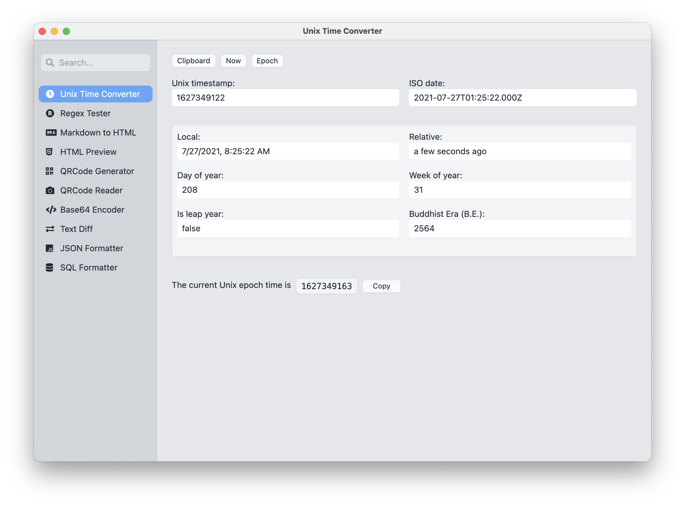
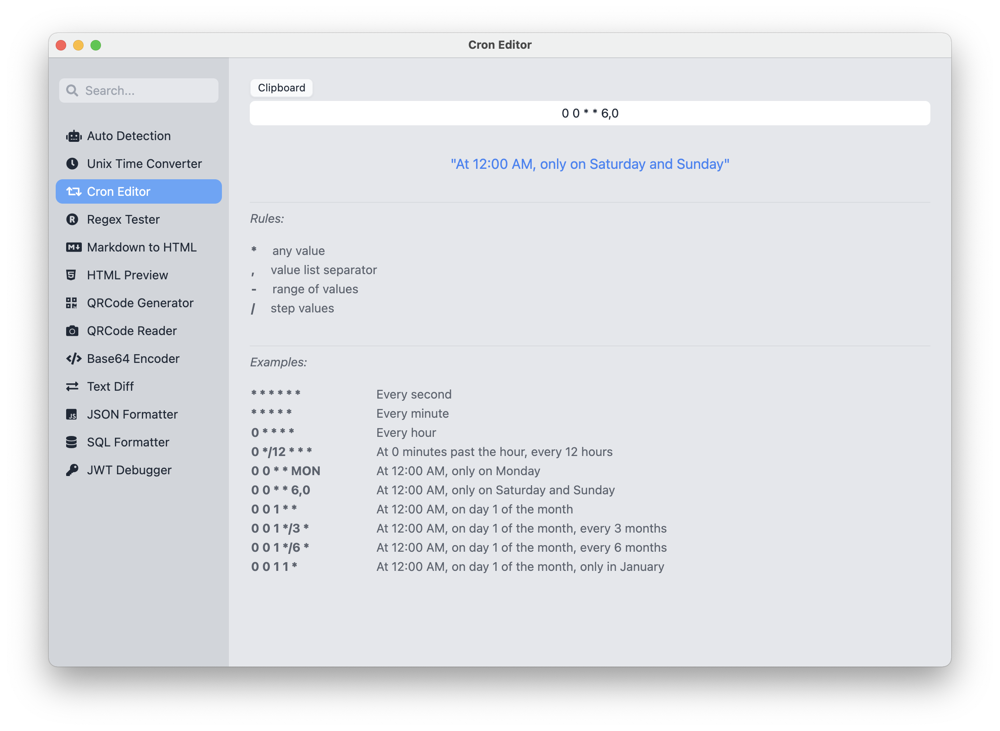
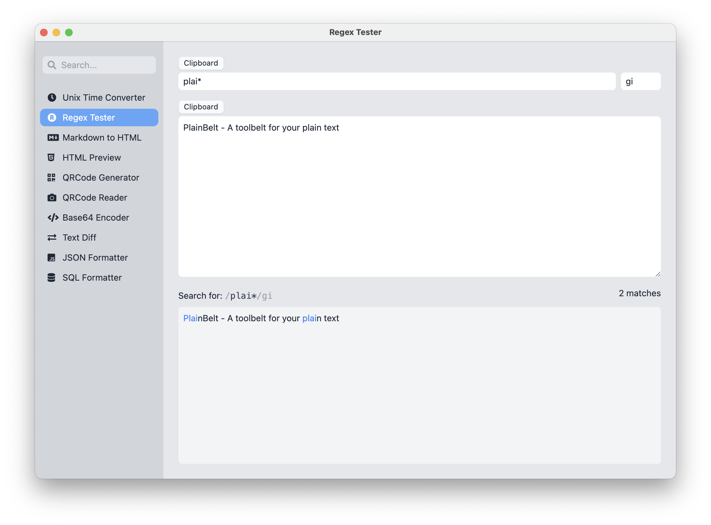
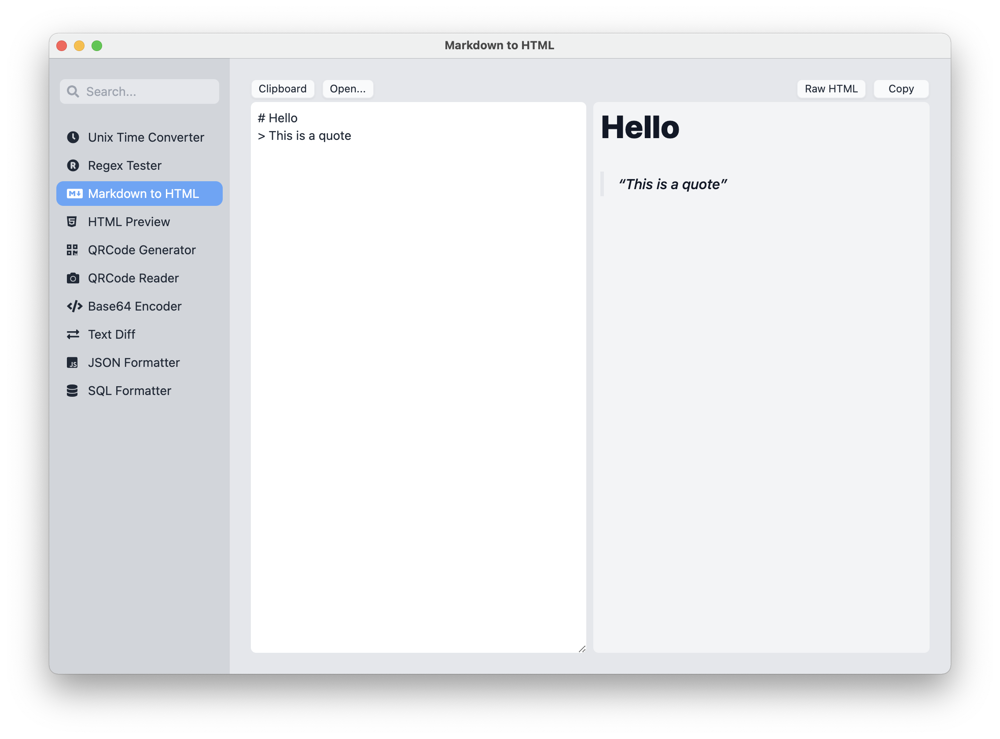

[](https://github.com/plainlab/plainbelt/actions/workflows/test.yml) [](https://github.com/plainlab/plainbelt/releases)

# PlainBelt

> Plain toolbelt for developers. Work offline. Cross-platform.

## Features

- [x] Multiple plain text tools
- [x] Tray icon
- [x] Clipboard auto detection
- [x] Global hotkey (Control+Alt+Meta+Space for now)

## Tools list

- [x] 1. Unix Timestamp Converter
- [x] 2. Cron Editor
- [x] 3. Markdown to HTML Converter
- [x] 4. HTML Preview
- [x] 5. QRCode Generator
- [x] 6. QRCode Reader
- [x] 7. Base64 Encode / Decode
- [x] 8. Text Diff
- [x] 9. JSON Formatter
- [x] 10. SQL Formatter
- [x] 11. Regex Tester
- [x] 12. JWT Debugger
- [x] 13. Js Console
- [x] 14. HTML Entity Encode / Decode
- [x] 15. URL Encode / Decode
- [x] 16. Backslash Encode / Decode

## Demo

### Unix Timestamp Converter



### Cron Editor



### Regex Tester



### Markdown to HTML converter



## Installation

Download binary file for your system on the releases page: https://github.com/plainlab/plainbelt/releases.

- macOS: Get `.dmg` file, open it and drag the app into Applications folder, for M1 mac: get `arm64.dmg` file instead.
- Windows: Get `.exe` file and open it to install.
- Linux: Get `.AppImage` file to install, for ARM laptop: get `arm64.AppImage` file instead.

## Development setup

```
yarn
yarn start
```

## Build binary

```
yarn package
```

Checkout the `release` folder and enjoy!

---

&copy; 2021 PlainLab
